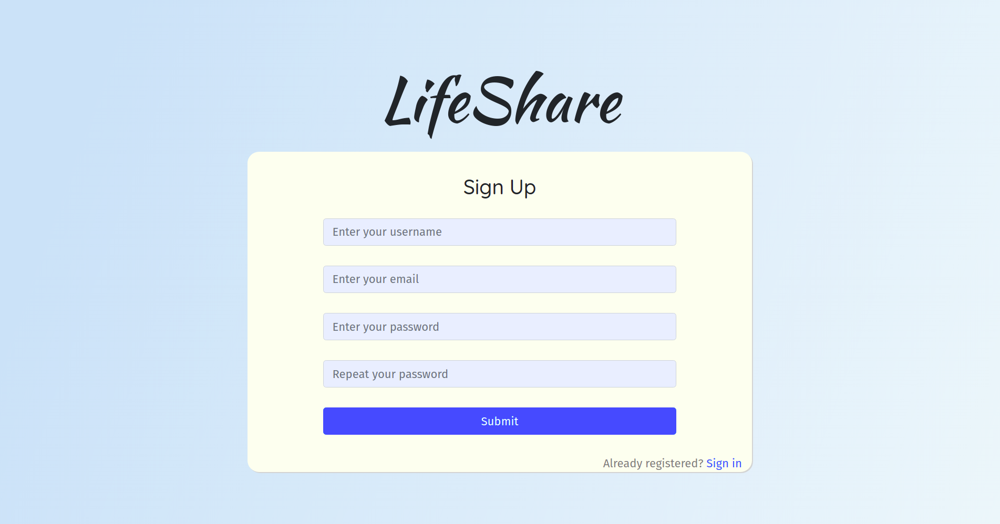
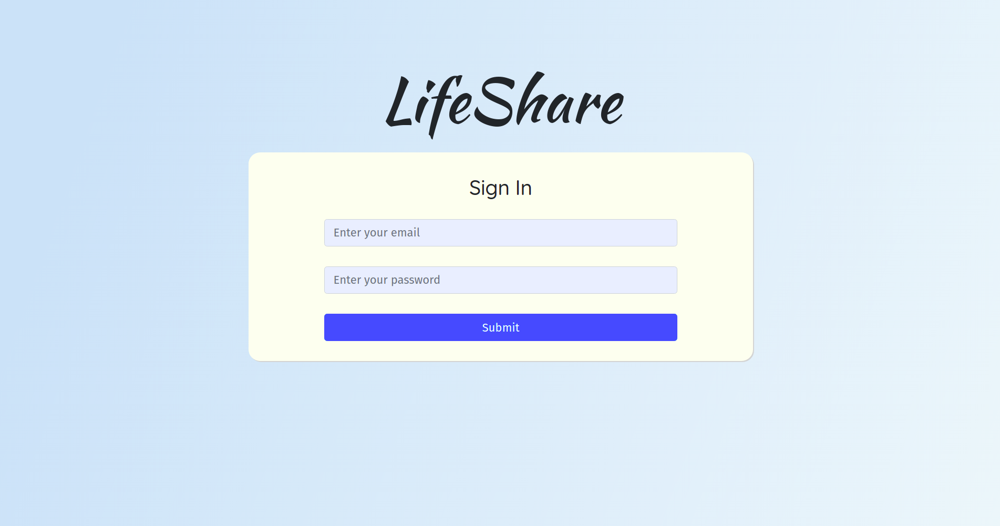
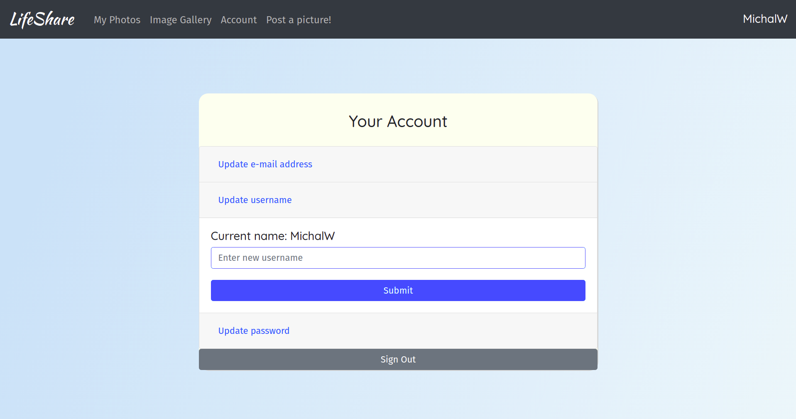
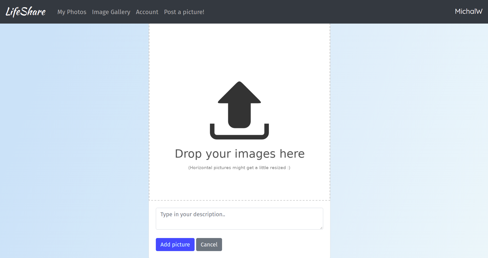
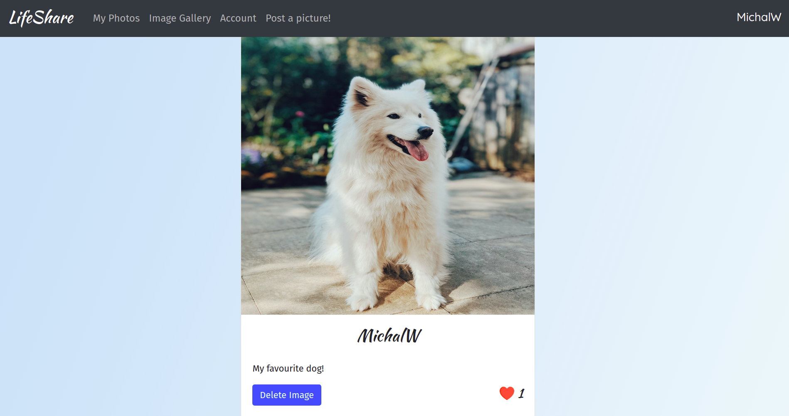
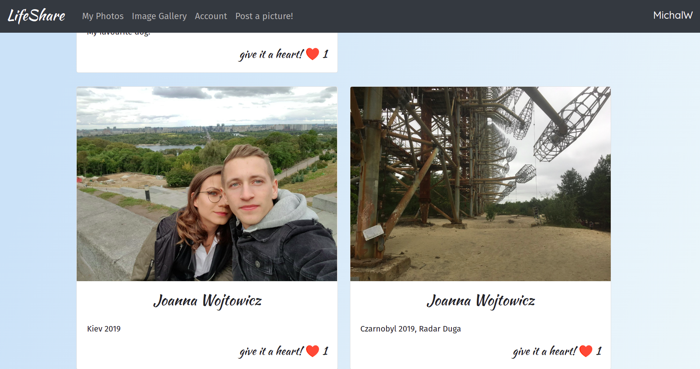

# Charakterystyka projektu
Aplikacja LifeShare to platforma służąca do zamieszczania zdjęć oraz przeglądania ich przez innych użytkowników.

### Cel aplikacji
Oddanie użytkownikom prostego w obsłudze narzędzia, dzięki któremu będą mogli nie tylko dzielić się zdjęciami ze znajomymi, ale także wraz z osobami z całego świata stworzyć portal społecznościowy, który pozwalałby patrzeć na rzeczywistość oczami innych.

### Funkcjonalności aplikacji
- Autoryzacja użytkownika

- Zmienianie danych konta

- Dodawanie i usuwanie zdjęć

- Reagowanie na zdjęcia użytkowników

### Linki do składowych projektu
- <a href="https://wizard.uek.krakow.pl/~s207722/LifeShare/#/">Aplikacja na serwerze UEK Wizard</a>  
- <a href="https://marvelapp.com/e69deih/screen/68573180">Prototyp aplikacji</a>  
- <a href="https://github.com/Seven730/LifeShare">Link do repozytorium na GitHub</a>  
- <a href="https://github.com/Seven730/LifeShare/projects/1">Link do zarządzania projektem informatycznym na GitHub</a>  
